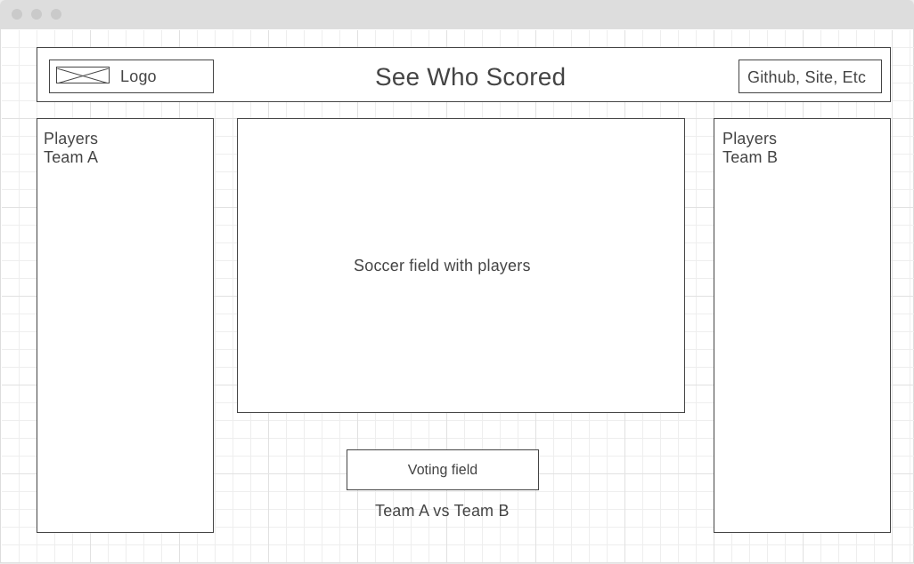

# SeeWhoScored

## Background and Overview 
Site for live soccer scores from across the world. Get livetime game data, teams line-ups, formations and team statistics.
Data and statistic will be presented with D3.js Javascript library for producing dynamic, interactive data.

## Wireframes

This app will have two screens. 
First will be the main home page as shown below.

    

When user clickes on specific game, game info will be shown as following

    

### Navbar will have logo, app name and links the Github, LinkedIn and Personal website.

## Libraries and Languages

* D3.js
* API-Football to collect the data
* Javascript
* HTML5
* CSS3/SCSS

## Features
* Visitors can see live scores for the selected league
* Visitors can select specific game and see the team formation, lineup and other statistic
* Some data will be displayed as bars 
* Canvas will be used to draw soccer pitch where team players names will be shown. 
* Users can click on each player to see data presented with D3.js 
* Visitors can vote for either team and data will be displayed below in form of chart/bar by D3.js

