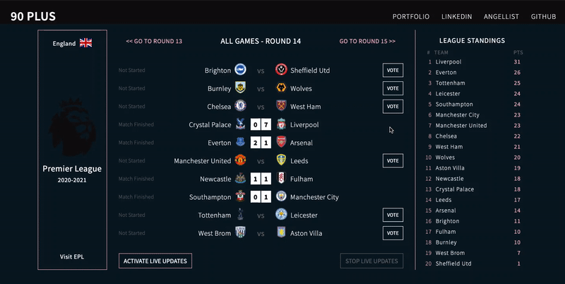

# 90Plus

  <a href="https://ninety-plus.herokuapp.com/">Live Site</a>

## Background and Overview 
NinetyPlus is a Web App for the live soccer scores from the most polular soccer league in a world - English Premier League. Get livetime data, teams line-ups and statistics. Data and statistics will be presented with D3.js javascript library, producing dynamic and interactive data.

## Libraries and Languages

* D3.js
* API-Football to collect the data
* Javascript
* HTML5
* CSS3/SCSS
* Node.js / Express
* Firebase Firestore database

## Features
* Visitors can select specific game and see the team formation, lineup and other game statistics.
* Each player game statistics is displayed on click.

* Live updates feature allow users to stay informed. Live updates could be manually turned off to save data.

* Visitors can vote for the game winner. The voting data is stored with Firebase/Firestore and will be displayed with by D3.js.

## Implementation Timeline
#### Preparation (12/6/2020) -0 Day, Sunday
* Ideas brainstorming
* UX/UI brainstorming
* API research
* Proposal

#### Project Architecture (12/7/2020) -1 Day, Monday
* Project architecture
* Libraries research
* Main page basic layout

#### Football API (12/8/2020) -1 Day, Tuesday
* Get API key and make requests
* Display some data from API request

#### Football API (12/10/2020) -2 Days, Wednsesday, Thursday
* Get API key and make requests
* Display some data from API request
* Research and implement basic of D3.js to display data

#### Final (12/11/2020) -1 Day, Friday
* Wrap up the project.
* Clear and smooth navigation
* Styling
* Readme 

