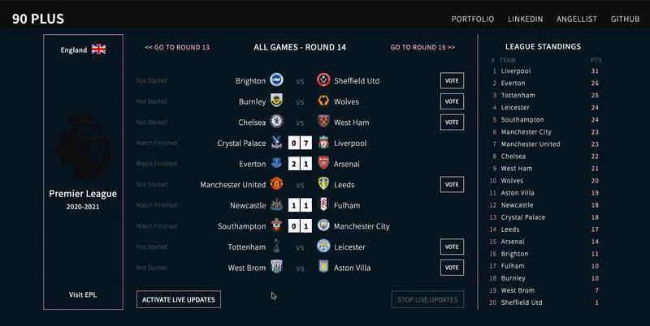
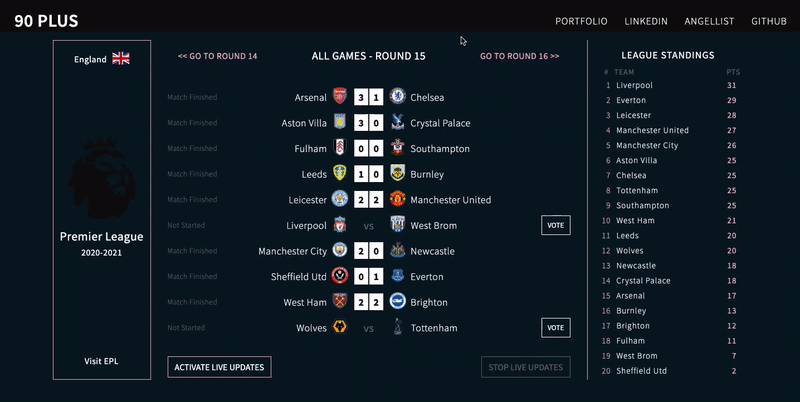

# 90Plus

<div align="start">
  <a href="https://ninety-plus.herokuapp.com/">Live Site</a>
</div>

## Background and Overview 
NinetyPlus is a Web App for live soccer scores from the most polular soccer league in a world - English Premier League. Get lifetime data, teams line-ups and statistics.

## Libraries and Languages

* Javascript
* Node.js / Express
* HTML5
* CSS3
* API-Football: Restful API for soccer data
* Firebase Firestore database
* D3.js


## Features
* Visitors can select specific game and see the team formation, lineup and other game statistics.
* Game statistics of each player is displayed on click.

<p>&nbsp;</p>

* Live updates feature is manually turned on/off to control the number of API calls. 

<p>&nbsp;</p>

* Visitors can vote for the game winner. The voting data is stored with Firebase/Firestore online database and displayed with by D3.js.

<p>&nbsp;</p>

## Code Highlights

### Live Updates
Live updates is a key feature of 90Plus web app. When 'Activate Live Updates' button is clicked, gamesRefresh.js function stores setInterval id into Local Starage to allow multiple page refresh. Set interval reference is cleared when user clicks on 'Stop Live Updates'.

```javascript
//gamesRefresh.js


const gamesRefresh = (btnLiveUpdates, btnNoLiveUpdates, round) => {

    let interval;
    
    btnLiveUpdates.addEventListener('click', () => {
        renderGames(round)
        interval = setInterval(() => renderGames(round), 10000);
        localStorage.setItem('localStInterval', interval);
        let counter = 0
        localStorage.setItem('localStCounter', counter);
    });
    
    btnNoLiveUpdates.addEventListener('click', () => {
        clearInterval(localStorage.getItem('localStInterval'));
        localStorage.removeItem('localStInterval');

        btnLiveUpdates.disabled = false;
        btnNoLiveUpdates.setAttribute('disabled', true);
    });

    if (localStorage.getItem('localStInterval') !== null){
        btnLiveUpdates.setAttribute('disabled', true);
        btnNoLiveUpdates.disabled = false;
    }else{
        btnLiveUpdates.disabled = false;
        btnNoLiveUpdates.setAttribute('disabled', true);
    }
}
```

Code below sets a newCounter variable to keep track of page refreshes (API calls). Currently, a newCounter is set to 3 for demostration purposes.
```javascript
 if (localStorage.getItem('localStCounter') !== null){
    let newCounter = localStorage.getItem('localStCounter');
    newCounter ++;
    localStorage.setItem('localStCounter', newCounter);
    if (newCounter === 3){
        clearInterval(localStorage.getItem('localStInterval'));
        localStorage.clear();
    }
}
```

### Data Animation with D3.js Library
Voting feature allows users to vote for the winner of any future game. Voting data is displayed with D3.js javascript library as a 'donut chart'.
```javascript
//drawPie.js
const drawPie = (vote1, vote2) => {

    const dims = {height:300, width:300, radius:150};
    const cent = {x: (dims.width / 2 + 5), y: (dims.height  /2 + 5)};

    const svg = d3.select('#pie-box')
        .append('svg')
        .attr('width', dims.width + 50)
        .attr('height', dims.height + 50)

    const graph = svg.append('g')
        .attr('transform', `translate(${cent.x}, ${cent.y})`)

    const pie = d3.pie()
        .sort(null)
        .value(d => d.value);

    const arcPath = d3.arc()
        .outerRadius(dims.radius)
        .innerRadius(dims.radius/1.5)
    
    const color = d3.scaleOrdinal(['#f5b7cd', '#0D0D0E'])

    const update = (data) => {

        color.domain(['team1', 'team2'])
        const paths = graph.selectAll('path')
            .data(pie(data));

        paths.exit().remove();
        paths.attr('d', arcPath);

        paths.enter()
            .append('path')
                .attr('class', 'arc')
                .attr('stroke', '#fff')
                .attr('stroke-width', 2)
                .attr('fill', d=>color(d.data.data.name))
                .transition().duration(1500) 
                    .attrTween('d', arcTweenEnter);
    };

    const data = pie([
        { name: 'team2', value: vote2 },
        { name: 'team1', value: vote1 }
    ])

    
    const arcTweenEnter = (d) => {
        let i = d3.interpolate(d.endAngle, d.startAngle);
        return function(t){
            d.startAngle = i(t);
            return arcPath(d);
        }
    };
    update(data);
}

export default drawPie;
```


## Implementation Timeline
#### Preparation (12/6/2020) -0 Day, Sunday
* Ideas brainstorming
* UX/UI brainstorming
* API research
* Proposal

#### Project Architecture (12/7/2020) -1 Day, Monday
* Project architecture
* Libraries research
* Main page basic layout

#### Football API (12/8/2020) -1 Day, Tuesday
* Get API key and make requests
* Display some data from API request

#### Football API (12/10/2020) -2 Days, Wednsesday, Thursday
* Get API key and make requests
* Display some data from API request
* Research and implement basic of D3.js to display data

#### Final (12/11/2020) -1 Day, Friday
* Wrap up the project.
* Clear and smooth navigation
* Styling
* Readme 

