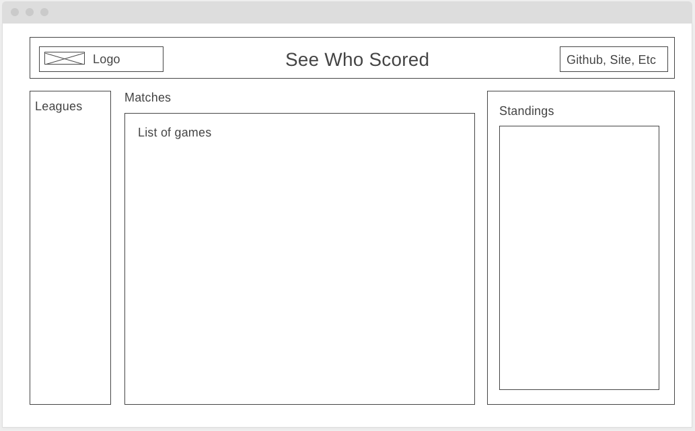

# NinetyPlus

## Background and Overview 
Ninety Plus is a site for live soccer scores from the most polular soccer league in a world -English Premier League. Get livetime game data, teams line-ups, formations and fixtures statistics. Data and statistics is be presented with D3.js Javascript library, producing dynamic and interactive data.

## Wireframes

The main page has the following layout:

    

## Libraries and Languages

* D3.js
* API-Football to collect the data
* Javascript
* HTML5
* CSS3/SCSS
* Node.js / Express
* Firebase Firestore database

## Features
* Visitors can see live scores for the selected league. Live updates could be manually turned on/off.
* Visitors can select specific game and see the team formation, lineup and other game statistics.
* Users can click on each player to see detailed satistics.
* Visitors can vote for the game winner. The voting data is store with Firebase/firestore and displayed with by D3.js

## Implementation Timeline
#### Preparation (12/6/2020) -0 Day, Sunday
* Ideas brainstorming
* UX/UI brainstorming
* API research
* Proposal

#### Project Architecture (12/7/2020) -1 Day, Monday
* Project architecture
* Libraries research
* Main page basic layout

#### Football API (12/8/2020) -1 Day, Tuesday
* Get API key and make requests
* Display some data from API request

#### Football API (12/10/2020) -2 Days, Wednsesday, Thursday
* Get API key and make requests
* Display some data from API request
* Research and implement basic of D3.js to display data

#### Final (12/11/2020) -1 Day, Friday
* Wrap up the project.
* Clear and smooth navigation
* Styling
* Readme 

